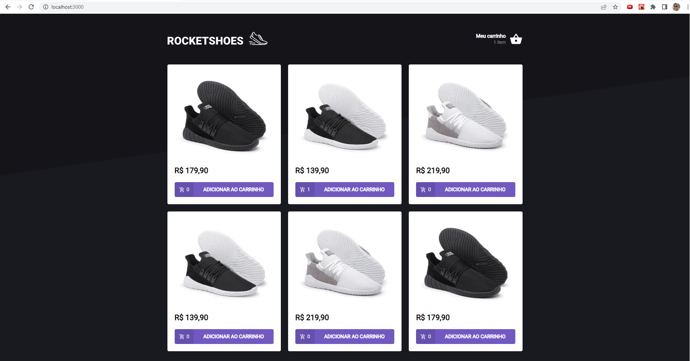
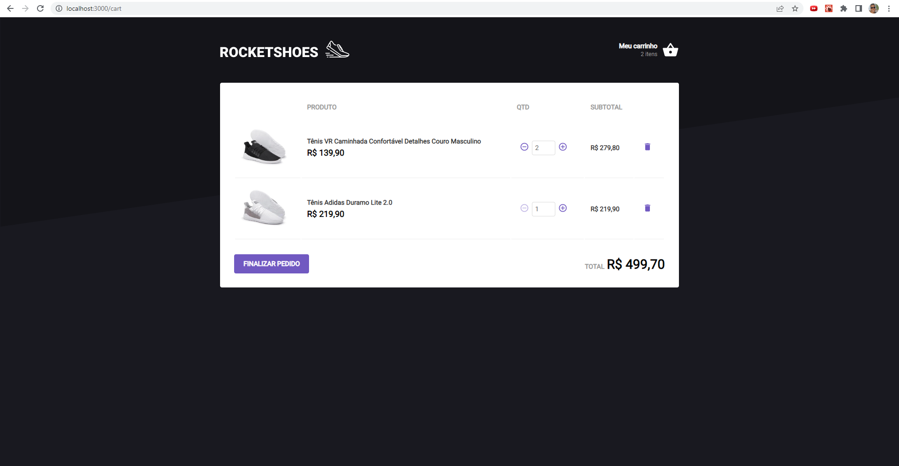

<h1 align="center"> 
  RocketShoes
</h1>

---

Table of Contents
=================
<!--ts-->
  * [Screenshots](#-screenshots)
  * [About the project](#-about-project)
  * [Technologies](#-technologies)
  * [How to use](#-how-to-use)
<!--te-->

---

## Screenshots <a name="-screenshots" style="text-decoration:none"></a>


          


---

## About the project <a name="-about-project" style="text-decoration:none"></a>

This project I did in the Rocketseat course. I collaborated to create the user interaction part. It allows the user to select the amount of shoes he wants. After that he could go to the cart and see which products he chose.

With that I was able to take a project in half, without some features, and do what was necessary for it to work. Making the code with TDD.

---

## Technologies <a name="-technologies" style="text-decoration:none"></a>
  
- **[React](https://en.reactjs.org/)**
- **[Typescript](https://www.typescriptlang.org/)**
- **[Styled-components](https://styled-components.com/)**

--- 

## How to use <a name="-how-to-use" style="text-decoration:none"></a>

```bash

# Clone this repository
$ git clone https://github.com/samircunha/RocketShoes.git

# Go to the folder
$ cd RocketShoes

# Install the dependencies
$ yarn install

# Run the server
$ yarn server

# Run the application 
$ yarn start

#The project will run on port <http://localhost:3000/>
```
